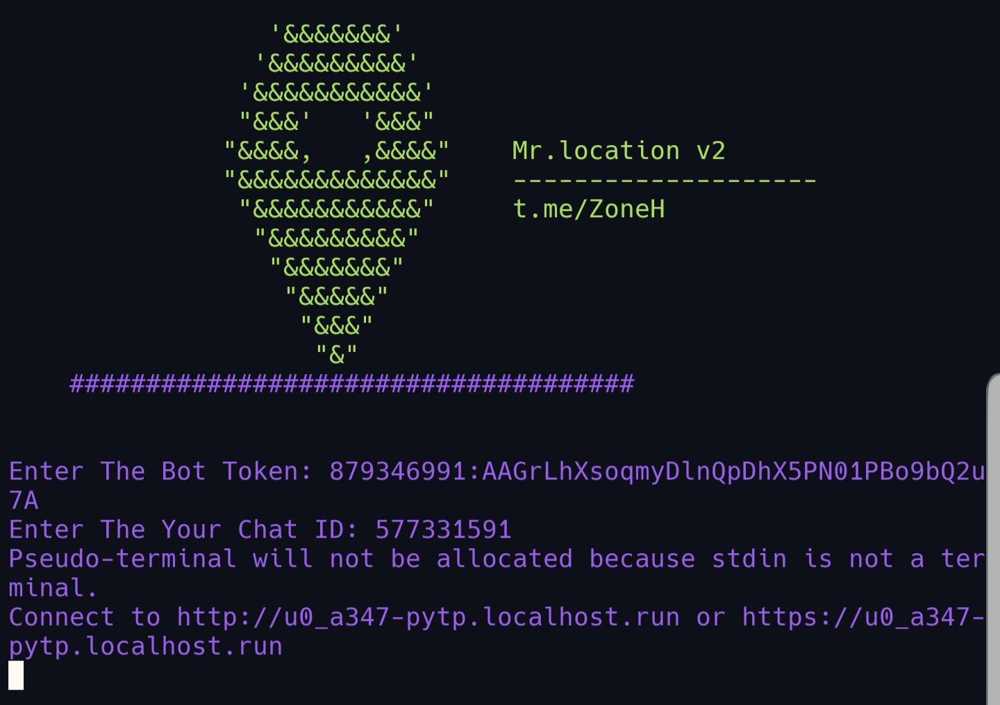

# Mr.location

get target location by link
 
# prerequisites
<pre>
<code>
apt update  
apt install git php python3 openssh -y  
pip3 install pyTelegramBotAPI 
</code></pre>

# run
<pre><code>
git clone https://github.com/mr0sploit/mrlocation  
cd mrlocation  
python3 mrlocation.py
</code></pre>

